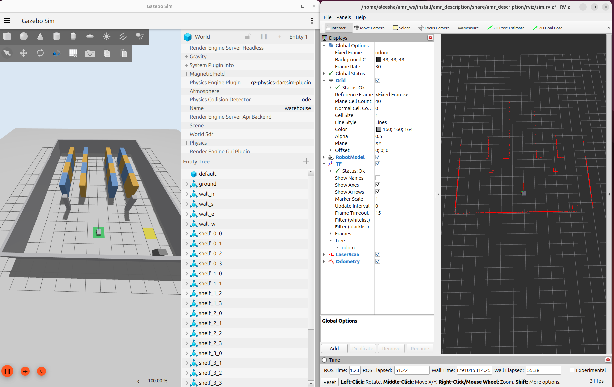
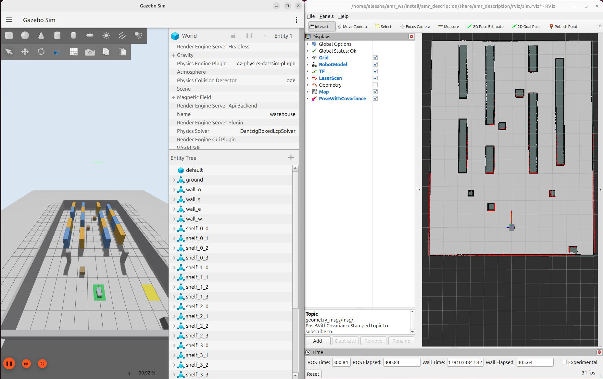

cd ~/amr_ws
cat > README.md <<'EOF'
# amr_ws: Autonomous Warehouse Mobile Robot (ROS 2 Jazzy)

Differential-drive AMR in a Gazebo Harmonic warehouse, built with SLAM Toolbox,
AMCL, robot_localization, Nav2 and ros2_control.

## Status
- [x] Phase 1: robot model, Gazebo warehouse, sensors, ros2_control, teleop (`v0.1.0`)
- [x] Phase 2: EKF sensor fusion, SLAM Toolbox mapping, AMCL localization (`v0.2.0`)
- [ ] Phase 3: Nav2, obstacle avoidance, missions

## Packages
| Package | Purpose |
|---|---|
| `amr_description` | URDF/Xacro robot model, RViz configs |
| `amr_gazebo` | Warehouse world (generated by `scripts/gen_world.py`), ROS-Gazebo bridge, simulation launch, test scripts |
| `amr_control` | `ros2_control` diff-drive controller configuration |
| `amr_localization` | EKF (`robot_localization`), map server and AMCL |
| `amr_slam` | SLAM Toolbox mapping configuration |
| `amr_navigation` | Saved maps (Nav2 configuration comes in Phase 3) |

## Requirements
Ubuntu 24.04, ROS 2 Jazzy, Gazebo Harmonic

## Build
    git clone git@github.com:AleeshaAPhilip/ROS2_Warehouse_AMR.git amr_ws
    cd amr_ws
    rosdep install --from-paths src -y --ignore-src
    colcon build --symlink-install && source install/setup.bash

## Run
Simulation (terminal 1):

    ros2 launch amr_gazebo sim.launch.py

Localize on the saved warehouse map (terminal 2; starts the EKF, map server and AMCL):

    ros2 launch amr_localization localization.launch.py

Drive with the keyboard (terminal 3):

    ros2 run teleop_twist_keyboard teleop_twist_keyboard --ros-args \
      -r cmd_vel:=/diff_drive_controller/cmd_vel -p stamped:=true -p use_sim_time:=true

## Re-making the map
Start the simulation, then the EKF and SLAM Toolbox, and drive slowly (about 0.25 m/s, avoid
spinning in place):

    ros2 launch amr_gazebo sim.launch.py
    ros2 launch amr_localization ekf.launch.py
    ros2 launch amr_slam mapping.launch.py
    ros2 run nav2_map_server map_saver_cli -f src/amr_navigation/maps/warehouse \
      --ros-args -p save_map_timeout:=10000.0

## Architecture (Phase 2)
| Transform | Published by |
|---|---|
| `map` to `odom` | SLAM Toolbox while mapping, AMCL while localizing (never both) |
| `odom` to `base_footprint` | EKF fusing wheel odometry and IMU yaw rate |
| `base_footprint` to links | `robot_state_publisher` |

The simulation is deliberately imperfect: noisy IMU and LiDAR, wheel slip, and a 3 % wheel-separation
calibration error. Gazebo's ground-truth odometry is used only for evaluation, never by any estimator.

## Results: localization accuracy
Closed-loop 2.5 x 1.5 m rectangle from HOME, compared with Gazebo ground truth
(`src/amr_gazebo/scripts/eval_localization.py`):

| Source | Mean position error | Max | Final | Mean heading error |
|---|---|---|---|---|
| Raw wheel odometry | 0.510 m | 1.221 m | 1.221 m | 18.4 deg |
| EKF (odom + IMU) | 0.007 m | 0.014 m | 0.008 m | 0.2 deg |
| AMCL (map frame) | 0.055 m | 0.154 m | 0.026 m | 1.6 deg |

Raw odometry drifts. The EKF removes most of it over short runs. AMCL gives a pose in the map frame
that does not accumulate drift, to within a few centimetres.

## Drive tests
`src/amr_gazebo/scripts/drive_test.py` and `drive_compare.py` run straight and spin tests and print
raw odometry, EKF and ground truth side by side.
EOF
