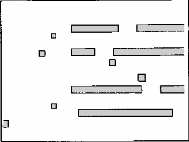

# Autonomous Warehouse AMR (ROS 2 Jazzy)

A differential-drive autonomous mobile robot in a Gazebo Harmonic warehouse. It builds a map with
SLAM Toolbox, localizes with AMCL and an EKF, and navigates with Nav2 to run a mission:
**HOME → Shelf A → Shelf B → Charging Station**, with moving-obstacle avoidance.

## Features
- Differential-drive robot (URDF/Xacro) with 2D LiDAR and IMU, controlled through `ros2_control`
- Generated Gazebo warehouse (`scripts/gen_world.py`), plus a variant with a moving obstacle
- EKF sensor fusion (`robot_localization`): wheel odometry + IMU yaw rate
- Mapping with SLAM Toolbox, localization with AMCL on the saved map
- Nav2 navigation with a Twist to TwistStamped bridge for the Jazzy `diff_drive_controller`
- Mission executor with named locations, retries and a CSV log of every run
- One-command bringup

## Packages
| Package | Purpose |
|---|---|
| `amr_description` | URDF/Xacro robot model, RViz config |
| `amr_gazebo` | Warehouse worlds, ROS-Gazebo bridge, simulation launch, test and evaluation scripts |
| `amr_control` | `ros2_control` diff-drive controller configuration |
| `amr_localization` | EKF, map server and AMCL |
| `amr_slam` | SLAM Toolbox mapping configuration |
| `amr_navigation` | Nav2 configuration, saved warehouse map |
| `amr_mission` | Mission executor, named locations, moving-obstacle node |
| `amr_bringup` | Top-level launch file |

## Requirements
Ubuntu 24.04, ROS 2 Jazzy, Gazebo Harmonic

## Build
    git clone git@github.com:AleeshaAPhilip/ROS2_Warehouse_AMR.git amr_ws
    cd amr_ws
    rosdep install --from-paths src -y --ignore-src
    colcon build --symlink-install && source install/setup.bash

The scripts and the mission log assume the workspace lives at `~/amr_ws`.

## Quick start
Whole system with the mission running by itself (the stack starts in stages, so give it about 90 s):

    ros2 launch amr_bringup full_system.launch.py mission:=true

| Argument | Default | Meaning |
|---|---|---|
| `mission` | `false` | Start the HOME to Shelf A to Shelf B to charger mission automatically |
| `dynamic` | `false` | Use the warehouse with a moving obstacle |

Without `mission:=true`, set goals in RViz with **2D Goal Pose**, or run the mission yourself:

    ros2 run amr_mission mission_executor --ros-args -p use_sim_time:=true

Named locations are in `src/amr_mission/config/locations.yaml`. Every run is appended to
`docs/mission_runs.csv`.

## Manual bringup
    ros2 launch amr_gazebo sim.launch.py                    # simulation
    ros2 launch amr_localization localization.launch.py     # EKF + map server + AMCL
    ros2 launch amr_navigation navigation.launch.py         # Nav2 + Twist stamper

Keyboard driving:

    ros2 run teleop_twist_keyboard teleop_twist_keyboard --ros-args \
      -r cmd_vel:=/diff_drive_controller/cmd_vel -p stamped:=true -p use_sim_time:=true

## Re-making the map
    ros2 launch amr_gazebo sim.launch.py
    ros2 launch amr_localization ekf.launch.py
    ros2 launch amr_slam mapping.launch.py
    ros2 run nav2_map_server map_saver_cli -f src/amr_navigation/maps/warehouse \
      --ros-args -p save_map_timeout:=10000.0

Drive slowly (about 0.25 m/s) and avoid spinning in place.

## Architecture
| Transform | Published by |
|---|---|
| `map` to `odom` | SLAM Toolbox while mapping, AMCL while navigating (never both) |
| `odom` to `base_footprint` | EKF (wheel odometry + IMU yaw rate) |
| `base_footprint` to links | `robot_state_publisher` |

Velocity chain: `controller_server → velocity_smoother → collision_monitor → /cmd_vel →
twist_stamper → /diff_drive_controller/cmd_vel`.

The simulation is deliberately imperfect: noisy IMU and LiDAR, wheel slip, and a 3 % wheel-separation
calibration error. Gazebo's ground-truth odometry is used only for evaluation, never by an estimator.

## Results
### Localization accuracy
Closed-loop 2.5 x 1.5 m rectangle from HOME, compared with ground truth
(`src/amr_gazebo/scripts/eval_localization.py`):

| Source | Mean position error | Max | Final | Mean heading error |
|---|---|---|---|---|
| Raw wheel odometry | 0.510 m | 1.221 m | 1.221 m | 18.4 deg |
| EKF (odom + IMU) | 0.007 m | 0.014 m | 0.008 m | 0.2 deg |
| AMCL (map frame) | 0.055 m | 0.154 m | 0.026 m | 1.6 deg |

Raw odometry drifts. The EKF removes most of it over short runs, but has no absolute reference.
AMCL gives a map-frame pose that does not accumulate drift, to within a few centimetres.

### Mission reliability
10 missions per condition (HOME to Shelf A to Shelf B to charger, about 26 m), run with
`src/amr_gazebo/scripts/run_batch.sh`:

| Condition | Success | Median time | Mean | Range | Retries |
|---|---|---|---|---|---|
| Static warehouse | 10 / 10 | 114 s | 102 s | 73 to 117 s | 0 |
| Moving obstacle | 10 / 10 | 115 s | 119 s | 111 to 162 s | 0 |

Times are simulation seconds. The static runs show two groups (seven near 115 s, three near 74 s);
the cause was not investigated. The charger parking position measured about 7 cm from the pad
centre in one check. Raw data: `docs/mission_runs_static.csv` and `docs/mission_runs_dynamic.csv`.

## Limitations
- Simulation only; no real hardware testing.
- The charging station is a navigation goal followed by a short wait. There is no docking
  controller or battery model.
- Localization was evaluated in a short run, and mission statistics come from 10 runs per
  condition on a single map.
- One moving obstacle on a fixed back-and-forth path.

## Roadmap
- Battery model with automatic return-to-charge
- Precise docking with Nav2's docking server
- Multi-robot fleet and task queue
- Tune the controller (MPPI) and compare against the defaults

## License
Apache-2.0
